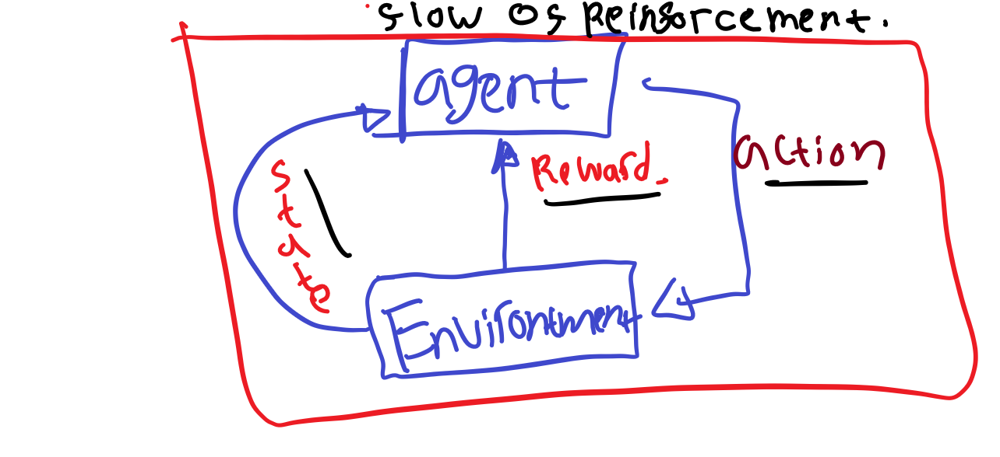
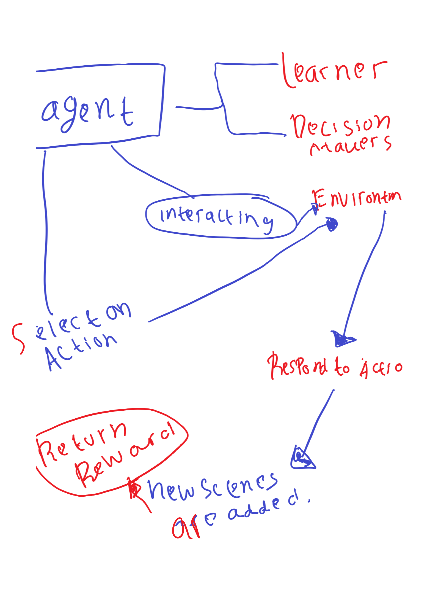

# ReinforcementLearningStuff

Reinforcement Learning Basics:

Well singkatnya **Reinforcement Learning** didasari dari pada **reward** dan **punishment** , selain itu, berikut juga beberapa Point penting dalam Reinforcement Learning

- Berbeda dengan Machine learning pada umumnya, well kita ga butuh training dataset

- Interaksi terjadi pada ***Lingkungannya*** Well, sesuai dengan kasus dunia nyata.

- Banyak parameter yang bermain pada reinforcement learning.

- ***Lingkungan*** pada reinforcement learning biasanya berada pada kasus 2D atau 3D

- Tujuan daripada Reinforcement learning ya mendapatkan **GOAL** nya.
- **Reward** didapat dari **Lingkungan** 
### In Nutsheel here's the reinforcement learning Flow 

### Here's the interaction Procss

Reinforcement learning pada intinya **mempelajari** pemilihan **aksi** yang memberikan **reward** maksimal.

**Contoh Maze**
- **Agent**  adalah Intellegent Program 
- **Environtment** adalah Maze 
- **State** Lokasi agent saat ini 
- **Action** Aksi yang akan diambil oleh Agent
- **Reward** Point yang didapat apabila berhasil mendapatkan **State** Tertentu. 

#### Formula

	r0 + r1 + yr2 + ... where 0 < y < 1
Here y = $\gamma$ (Gamma)
Gamma biasa di sebut **Discount Factor** dan menentukan **reward** kedepannya.
Note For $\gamma$ :
	- Kalau valuenya **0** berarti **reward** nya hanya berhubungan dengan **state** saat ini saja.
	- Kalau valuenya 1 berarti rewardnya telah berlangusng **lama** atau berada di beberapa state. 

**Gamma ($\gamma$)**
Gamma digunakan pada setiap **Pergantian** state, dan nilai dari **Gamma** tersebut juga berganti. **Gamma** dapat memberikan infromasi mengenai **TIPE** reward yang didapat . Bisa untuk state saat ini **0** atau long term reward **1**.
**Lambda ($\lambda$)**
Lambda biasa digunakan ketika menghadapi permasalahan **Temporal Difference** Biasanya banyak dilibatkan pada **Prediksi**. Increasing / menambah nilai **$\lambda$** pada Setiap state akan berpengaruh terhadap **Cepatnya** algoritma belajar.

